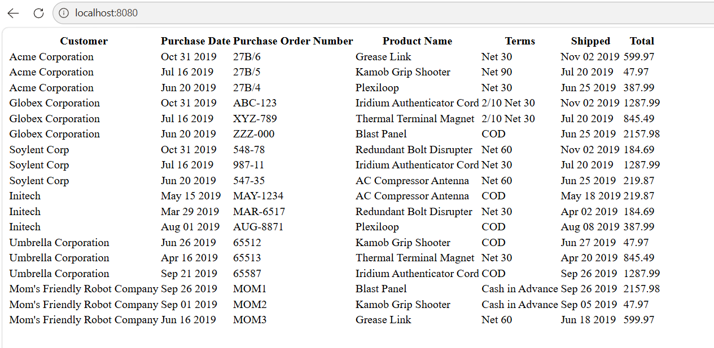

# Spring Wholesale Order Management

A Spring Boot web application for managing and displaying wholesale order data using MVC architecture, REST APIs, JPA, Thymeleaf, and an H2 in-memory database.

This project demonstrates backend Java development concepts including:
- Spring Boot application structure
- RESTful API development
- JPA entity relationships
- MVC architecture
- Thymeleaf server-side rendering
- Database integration using H2

---

## Features

### Wholesale Order Dashboard
- Displays wholesale customer order information
- Dynamic order table rendered with Thymeleaf
- Customer, product, order, and shipping data displayed in a web interface

### REST API
- JSON API endpoint for retrieving wholesale order data
- DTO-based response structure

### Database Integration
- Spring Data JPA and Hibernate
- Entity relationships between:
    - Customers
    - Products
    - Wholesale Orders

### Layered Architecture
Project organized into:
- Controllers
- Services
- DTOs
- Entities
- Repositories

---

## Technologies Used

### Backend
- Java 17
- Spring Boot 3
- Spring MVC
- Spring Data JPA
- Hibernate

### Frontend
- Thymeleaf
- HTML

### Database
- H2 In-Memory Database

### Build Tools
- Maven
- Lombok

---

## Application Screenshots

### Wholesale Order Dashboard



---

## REST API Endpoint

```txt
http://localhost:8080/api/orders/
```

Returns JSON order data from the application database.

---

## Running the Application

### Clone Repository

```bash
git clone https://github.com/gfarley1217/spring-wholesale-order-management.git
```

### Open Project
Open the project in IntelliJ IDEA or another Java IDE.

### Run Application

```bash
mvn spring-boot:run
```

### Access Application

Main Application:
```txt
http://localhost:8080
```

REST API:
```txt
http://localhost:8080/api/orders/
```

H2 Console:
```txt
http://localhost:8080/h2-console
```

---

## Key Concepts Demonstrated

- Spring Boot application setup
- MVC architecture
- REST API development
- JPA/Hibernate entity mapping
- DTO pattern
- Dependency injection
- Database integration
- Maven dependency management

---

## Future Improvements

- Bootstrap UI styling
- CRUD functionality
- Search and filtering
- Authentication and authorization
- Persistent SQL database support
- Cloud deployment

---

## Author

Grant Farley

GitHub:
https://github.com/gfarley1217